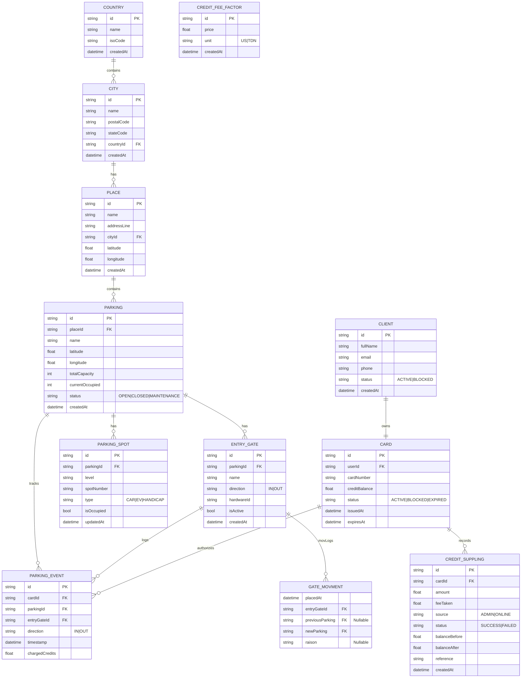

# Project Overview

This is a parking management system built with Kotlin and Spring Boot. It uses a microservices architecture with separate services for different functionalities. The system uses PostgreSQL and MongoDB for data storage.

## Building and Running

### Prerequisites

- Java 21
- Docker

### Running the application

1.  **Set up the environment variables:**

    Create a `.env` file in the root of the project and add the following environment variables:

    ```
    DATABASE_HOST=localhost
    DATABASE_PORT=5432
    DATABASE_NAME=parking
    DATABASE_CLIENTNAME=admin
    DATABASE_PASSWORD=admin
    DATABASE_CONTAINER_NAME=parking-db

    MONGODB_HOST=localhost
    MONGODB_PORT=27017
    MONGODB_DBNAME=parking
    MONGODB_CLIENTNAME=admin
    MONGODB_PASSWORD=admin
    MONGODB_CONTAINER=parking-mongodb
    ```

2.  **Start the databases:**

    ```
    docker-compose up -d
    ```

3.  **Run the application:**

    ```
    ./gradlew bootRun
    ```

### Testing the application

To run the tests, use the following command:

```
./gradlew test
```

## Development Conventions

The project follows a consistent set of conventions to ensure code is clean, maintainable, and uniform across all features.

### General Principles

*   **Language**: Kotlin is the primary programming language.
*   **Framework**: The application is built using Spring Boot.
*   **Dependency Management**: Gradle is used for managing dependencies and building the project.
*   **API Documentation**: `springdoc-openapi` is used for automatic generation of OpenAPI specifications. The Swagger UI can be accessed at `http://localhost:8080/swagger-ui.html`.
*   **Database**: The project uses a hybrid database approach:
    *   **PostgreSQL**: For core relational data (e.g., `Client`, `Card`, `Parking`, `CreditSuppling`). Handled via Spring Data JPA.
    *   **MongoDB**: For event-sourcing and logging data (e.g., `ParkingEvent`, `GateMovement`). Handled via Spring Data MongoDB.

### Feature Structure & Implementation Style

Each feature is self-contained within its own package under `com.parking.management.features` and follows a strict layered architecture and implementation style.

1.  **Domain Model (`<Feature>.kt`)**
    *   A `data class` representing the core entity.
    *   **JPA Entities (PostgreSQL)**:
        *   Annotated with `@Entity` and `@Table`.
        *   Primary Key `id` is a `UUID` generated with `@GeneratedValue(strategy = GenerationType.UUID)`.
        *   Uses `@CreationTimestamp` and `@UpdateTimestamp` for `createdAt` and `updatedAt` fields.
        *   **Must include a `deletedAt: LocalDateTime? = null` field** for soft deletion.
    *   **Mongo Documents (MongoDB)**:
        *   Annotated with `@Document`.
        *   Primary Key `id` is a `String?`.
        *   **Must include a `deletedAt: LocalDateTime? = null` field** for soft deletion.
        *   May contain direct references to JPA entities (e.g., `var card: Card`). Spring Data will store the referenced entity's ID.

2.  **DTOs and Mapper (`models/<Feature>Dto.kt`)**
    *   This file contains all Data Transfer Objects and the mapper for the feature.
    *   **DTOs**:
        *   `...Create`: A `data class` for handling creation requests. Fields are annotated with `jakarta.validation.constraints` (e.g., `@NotNull`, `@Size`).
        *   `...Update`: (If applicable) A `data class` for handling update requests.
        *   `...Response`: A `data class` representing the data sent back to the client. It often includes nested `...Response` objects for related entities.
    *   **Mapper**:
        *   An `object` named `<Feature>Mapper`.
        *   `toEntity()`: A function that takes a `...Create` DTO and any required, pre-fetched related entities to create a new domain model instance.
        *   `toResponse()`: A function that takes a domain model instance and returns a `...Response` DTO. It is responsible for calling other mappers (e.g., `CardMapper.toResponse()`) to construct nested response objects.

3.  **Repository (`<Feature>Repository.kt`)**
    *   An interface annotated with `@Repository`.
    *   **JPA Repositories**: Extend `JpaRepository<Entity, UUID>`.
    *   **Mongo Repositories**: Extend `MongoRepository<Document, String>`.
    *   **Must include a `findAllByDeletedAtIsNull(pageable: Pageable): Page<Entity>`** method to support soft deletion.

4.  **Service (`<Feature>Service.kt`)**
    *   A class annotated with `@Service`.
    *   The constructor injects all required repositories (e.g., `val repository: <Feature>Repository`, `val cardRepository: CardRepository`).
    *   Methods are **blocking** (i.e., they are *not* `suspend` functions).
    *   Read-only operations like `getById` and `getAll` are annotated with `@Transactional(readOnly = true)`.
    *   **`create()` Method**: Takes a `...Create` DTO, fetches related entities using injected repositories to validate their existence, calls the mapper's `toEntity()` method, saves the new entity, and returns a `...Response` DTO.
    *   **`delete()` Method**: Implements soft deletion by finding the entity, setting its `deletedAt` property to the current time, and saving it. It returns a `Message` object.
    *   Throws `com.parking.management.comman.models.NotFoundException` when an entity cannot be found.

5.  **Controller (`<Feature>Controller.kt`)**
    *   A class annotated with `@RestController` and a base `@RequestMapping`.
    *   Methods are **blocking**.
    *   Request body DTOs (`...Create`, `...Update`) are annotated with `@Valid` to trigger validation.
    *   **Methods return DTOs (`...Response`), `Page<...Response>`, or `Message` objects directly.** They do not wrap responses in `ResponseEntity`.
    *   Standard endpoints include `POST /`, `POST /all`, `GET /{id}`, `GET`, and `DELETE /{id}`.

The `gate_movement` (MongoDB) and `credit_suppling` (PostgreSQL) features are excellent, up-to-date examples of this structure.

## Database Schema

The following diagram shows the database schema of the application:


