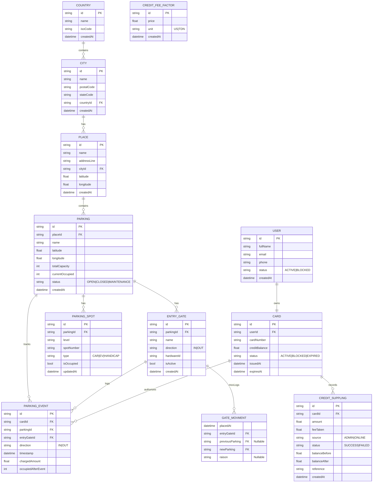

# Project Overview

This is a parking management system built with Kotlin and Spring Boot. It uses a microservices architecture with separate services for different functionalities. The system uses PostgreSQL and MongoDB for data storage.

## Building and Running

### Prerequisites

- Java 21
- Docker

### Running the application

1.  **Set up the environment variables:**

    Create a `.env` file in the root of the project and add the following environment variables:

    ```
    DATABASE_HOST=localhost
    DATABASE_PORT=5432
    DATABASE_NAME=parking
    DATABASE_USERNAME=admin
    DATABASE_PASSWORD=admin
    DATABASE_CONTAINER_NAME=parking-db

    MONGODB_HOST=localhost
    MONGODB_PORT=27017
    MONGODB_DBNAME=parking
    MONGODB_USERNAME=admin
    MONGODB_PASSWORD=admin
    MONGODB_CONTAINER=parking-mongodb
    ```

2.  **Start the databases:**

    ```
    docker-compose up -d
    ```

3.  **Run the application:**

    ```
    ./gradlew bootRun
    ```

### Testing the application

To run the tests, use the following command:

```
./gradlew test
```

## Development Conventions

- The project uses Kotlin as the primary programming language.
- The project follows the standard Spring Boot project structure.
- The project uses Gradle for dependency management and building.
- The project uses Docker for running the databases in a containerized environment.
- The project uses `springdoc-openapi` to generate API documentation. You can access the Swagger UI at `http://localhost:8080/swagger-ui.html`.
- The project is divided into features, and each feature should follow the layered architecture described in the "Feature Structure" section. The `client` and `parking_spot` features serve as good examples of this structure.

## Feature Structure

Each feature in the project should follow a layered architecture, which consists of the following components:

-   **Controller:** The controller is responsible for handling HTTP requests and exposing the feature's API. It should be located in the feature's root directory and named `<Feature>Controller.kt`.
-   **Service:** The service contains the business logic for the feature. It should be located in the feature's root directory and named `<Feature>Service.kt`.
-   **Repository:** The repository is responsible for interacting with the database. It should be located in the feature's root directory and named `<Feature>Repository.kt`.
-   **Domain Model:** The domain model represents the feature's data. It should be located in the feature's root directory and named `<Feature>.kt`.
-   **DTOs:** The DTOs (Data Transfer Objects) are used for transferring data between the client and the server. They should be located in a `models` subdirectory and named `<Feature>Dto.kt`.
-   **Mapper:** The mapper is responsible for converting between DTOs and entities. It should be located in the `<Feature>Dto.kt` file.

This structure helps to keep the code organized and easy to maintain.

## Database Schema

The following diagram shows the database schema of the application:


